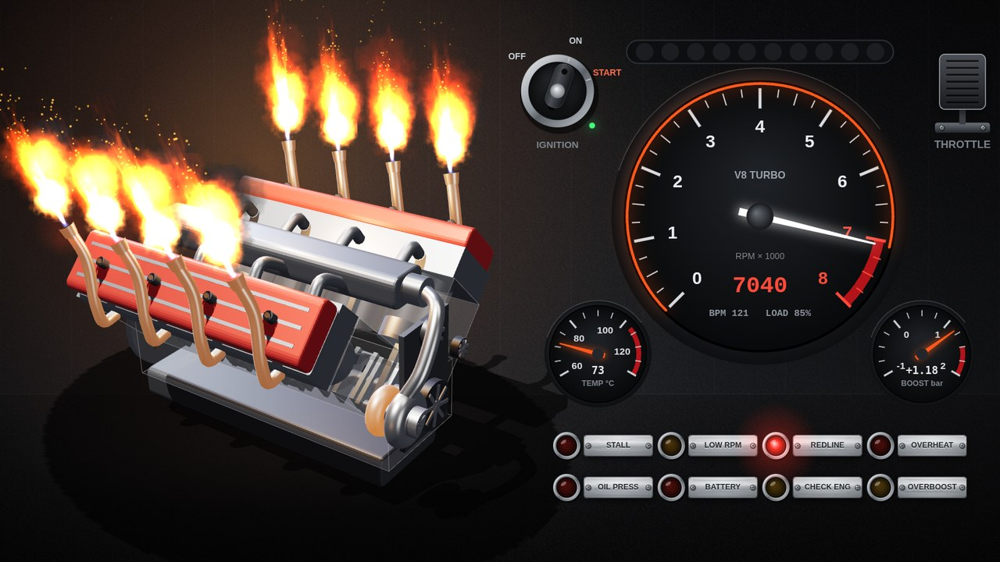

# Music Engine: audio-reactive wallpaper for Wallpaper Engine

A web wallpaper with a 3D engine. The engine revs up to the music, and on the most powerful moments flames shoot out of the exhaust. On the right is a dashboard: tachometer, temperature, boost, warning lamps, an ignition key, a throttle pedal, an odometer and a car radio that shows what's playing.

**[Get it on Steam Workshop](https://steamcommunity.com/sharedfiles/filedetails/?id=3806831743)** · **[Live demo](https://wladbelsky.github.io/music-engine/)**



## Controls

| Element | Action |
|---|---|
| **Ignition key** (left, above the tachometer) | Click to toggle OFF/ON. When switched on, all lamps light up for ~1 s as a bulb check, then the starter cranks the engine and it starts. When switched off, the engine stalls, the gauges go dark, and it ignores the music. |
| **Throttle pedal** (right, above the tachometer) | While the mouse button is held, RPM climbs all the way to the rev limiter: you get flames, backfire "pops" when you lift off, and the hiss of the blow-off valve. The pedal works without music too and can restart a stalled engine on its own. |
| Keyboard (browser only) | `Space` or `↑` act as the pedal, `I` turns the key. |

## Settings (wallpaper properties panel in WE)

- **Ignition on**: key position at startup.
- **Show key and throttle pedal**.
- **Car radio** (off by default): a 1-DIN head unit under the lamps. It shows the current track as a scrolling line (▶/❚❚/■, track number, clock). The data comes from WE's media integration, which you enable in **WE settings → Media integration**; it works with any player that shows up in the Windows media overlay (Spotify, browsers, AIMP…). Without track info the display shows `AUX` and a small spectrum analyzer. The volume knob is decorative: its LED ring works as a level meter. The radio runs off the ignition.
- **Layout**: inline, V, boxer, W (two narrow VR banks with staggered cylinders, like the VW W12 / Bugatti W16), radial (an aircraft star engine on a stand, flames from short stubs all round), rotary (Wankel: triangular rotors orbit the eccentric shaft inside epitrochoid housings, visible in cutaway mode; one exhaust stack per rotor), steam or turbojet:
  - **Steam engine**: a horizontal mill engine with a vertical boiler. Double-acting cylinders with crossheads, connecting rods and disc cranks, slide valves worked by eccentrics, a spoked flywheel and a Watt flyball governor whose balls fly out with the revs. The exhaust goes up the chimney, so every stroke is a chuff of steam; on the loud parts the fire roars (the firebox door glows, sparks and thick smoke from the chimney). When the boiler pressure reaches the top of the gauge the safety valve blows off; on start-up the drain cocks spit steam. The shaft turns at the speed the dash shows (up to 200 rpm).
  - **Turbojet (afterburner)**: an engine on a display stand. In cutaway mode you see the compressor stages, the combustor cans, the turbine and the flame holders; the spool spins with the revs (the spinner has a painted spiral). On the loud parts the afterburner lights: a long plume with shock diamonds, and the nozzle petals open.
- **Number of cylinders**: 1–32. The layout rounds it up where needed: V and boxer to an even number, W to a multiple of 4 (8 minimum), radial to an odd number per row with up to 9 per row (5 → 5, 8 → 9, 14 → 2 rows of 7, 18 → 2 × 9, 28+ → 4 × 7). For the rotary the number is the rotor count (2 = like a 13B, 3 = 20B, 4 = 26B). Steam: 1–8 cylinders. Turbojet: the number of combustor cans, 6–16.
- **Forced induction**: none, turbo, twin turbo, quad turbo, supercharger (Roots blower) or twincharged (blower + twin turbos).
  - Turbo size barely depends on the cylinder count (the block's height and width don't either), so a small engine gets proper-size turbos; they grow a little on big engines (V12, V16). Twin and quad setups use the same size as a single. Boost comes with lag and needs revs; lifting off gives the blow-off valve hiss.
  - The Roots blower sits on the intake and is belt-driven from the crank; its rotors show in cutaway mode. On top is a butterfly injector hat: three round butterflies (in the valve cover colour) that open with the throttle, so they follow the pedal and loud parts of the music. Boost is instant and grows with RPM, and there is no blow-off valve.
  - Twincharged: the blower gives boost right away, the turbos take over higher up and blow into a hat on the blower.
  - None: an air filter, and the boost gauge shows manifold vacuum.
  - The radial is always naturally aspirated: the setting is hidden for it (disabled in the settings panel), any saved option acts as none and the boost gauge shows manifold vacuum.
  - Steam and turbojet have no forced induction either; the setting is hidden for them too.
- **Cutaway block**: a semi-transparent block that shows the pistons, connecting rods and crankshaft.
- **Valve cover color**, **gauge backlight color**.
- **Background**: Garage, Carbon, Gradient (custom color), Custom image. Plus background dimming.
- **Audio sensitivity**, **rev limiter**, **flame threshold** (lower means more frequent flames).
- **Stall after silence, s**.
- **Crankshaft animation speed**, **engine sway strength**.
- **Graphics quality**: low, medium, high. If the wallpaper loads your system too much, also cap the FPS in the WE settings.
- **Show BPM and load**, **debug info** (BPM, confidence, loudness, engine state).
- **Odometer**: kilometers, miles or hidden. The ODO and TRIP drum counters under the tachometer add mileage while the engine runs, faster at higher RPM (about 30 km/h per 1000 rpm). Click the counter to reset TRIP. Mileage is kept in the wallpaper's local storage. In Wallpaper Engine that storage belongs to each monitor, and WE may clear it (screensaver mode, cache reset), so treat it as best effort.

## Warning lamps

| Lamp | When it lights up |
|---|---|
| STALL | The engine has stalled: silence longer than the configured time and the pedal is not pressed |
| LOW RPM | RPM stays low for a long time (quiet or slow music) |
| REDLINE | RPM at the rev limiter |
| OVERHEAT | Sustained peak load. Blinks above 118 °C |
| OIL PRESS | RPM below 500: the engine has stalled or the starter is cranking |
| BATTERY | The engine has stalled or the starter is cranking |
| CHECK ENG | The music is loud, but the analyzer can't lock onto the beat for several seconds |
| OVERBOOST | Boost stays near maximum for more than a second |

The steam engine and the turbojet use their own dash scales: steam shows the shaft rpm (0–250, red from 200) and the boiler pressure (STEAM bar) instead of boost; the turbojet shows % RPM (idle about 60 %, 100 % at the top) and the exhaust gas temperature (EGT, °C) instead of boost, and the oil temperature on the left gauge. Some lamps are renamed: steam OVERBOOST → SAFETY VLV (the safety valve is blowing off); turbojet STALL → FLAMEOUT, BATTERY → STARTER, OVERBOOST → EGT HIGH. The rev limiter setting only applies to the piston engines.

## How it works

- About 30 times per second WE passes the audio spectrum (64 bands per channel). BPM is computed by the wallpaper itself: it looks for the repetition period of the beats from energy jumps in the bass (autocorrelation over a ~10 s window).
- RPM is made up of loudness, BPM, beat density, kicks on strong beats and the throttle pedal.
- Flames appear when the "power" (loudness relative to the track + BPM + beat density) is above the threshold. They are drawn as shader jets with procedural turbulence, plus fireballs on backfires and sparks. The same moments stoke the steam engine's fire and light the turbojet's afterburner.

## Testing without Wallpaper Engine

Open `index.html` in Chrome. A **Settings** panel will appear: demo beat, microphone, audio file, engine and background selection. **Hide** leaves a small **Settings** button in the top-left corner to bring it back; `D` toggles the panel too. The panel has every setting of the WE version and remembers them between visits (except a custom background image); URL parameters override them without being saved. It also has buttons to reset TRIP, the odometer and the saved settings. The radio is off by default: tick `radio` (or add `?showradio=true`); it shows the name of the audio file you picked (`Artist - Title.mp3` is split into artist and title), otherwise `AUX`.
The microphone requires a local server:

```
python -m http.server 8000
# http://localhost:8000/?debug=true
```

Parameters can be passed in the URL: `?demo=1&layout=radial&cylinders=9&turbos=sc&background=carbon&ignition=false`.

## Files

```
index.html        markup and script loading
project.json      wallpaper description and properties for WE
preview.jpg       preview
js/audio.js       audio analysis: BPM, beats, loudness, silence; demo and browser audio sources
js/sim.js         engine model: states, RPM, boost (turbo / blower / vacuum), temperature, flames, lamps, key, pedal
js/engine3d.js    Three.js 3D scene: cylinders and kinematics, camera, shadows, sway, flames, smoke
js/layouts.js     engine layouts as classes: inline, V, boxer, W, radial, rotary
js/steam.js       steam engine layout: mill engine, boiler, chuffs, sparks, safety valve
js/jet.js         turbojet layout: compressor, cans, turbine, afterburner plume, nozzle
js/induction.js   forced induction options and parts: air filter, turbos, Roots blower
js/dash.js        dashboard on a 2D canvas, key and pedal
js/bg.js          backgrounds
js/media.js       now playing for the radio (WE media integration, or the picked audio file)
js/odometer.js    odometer and trip counter, kept in localStorage
js/main.js        glue: WE properties, audio, input, main loop
js/three.min.js   Three.js r149 (MIT, license in js/three.LICENSE.txt)
```
